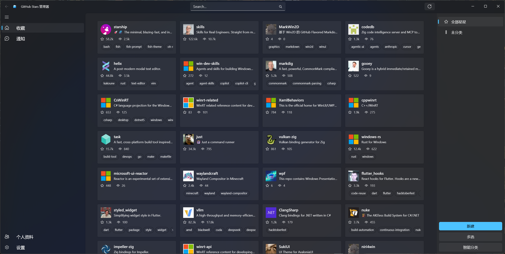
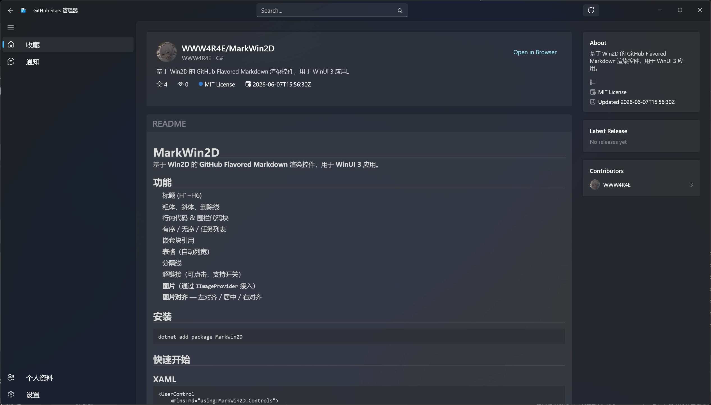
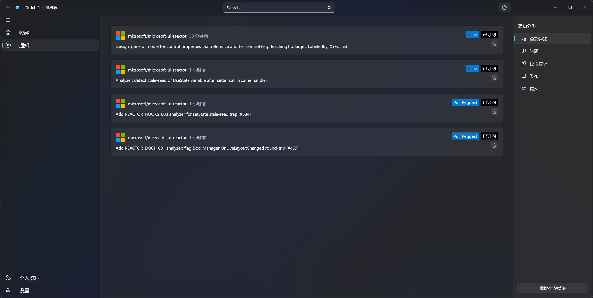
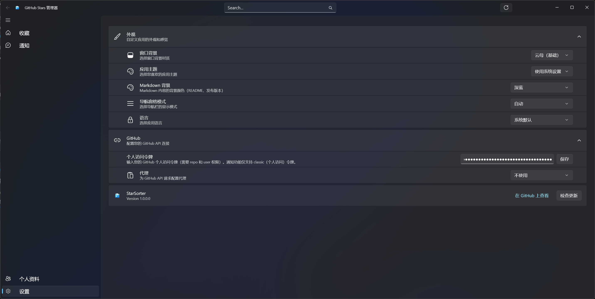

# StarSorter

一款使用 WinUI 3 开发的 GitHub 星标仓库管理工具，帮助您轻松分类和检索您的星标仓库。

## 安装

### 从微软商店安装

[](https://apps.microsoft.com/detail/9N6RPJR5WHHL?hl=zh-cn&gl=CN&ocid=pdpshare)

### 手动构建

```powershell
# 克隆仓库
git clone https://github.com/WWW4R4E/StarSorter.git
cd StarSorter

# 构建项目
.\build.ps1 --target BuildWinUIApp
```

## 使用方法

### 1. 配置 GitHub Token

首次启动应用后，请在设置页面配置您的 GitHub Personal Access Token：

1. 打开应用设置（点击导航栏的 Settings）
2. 在 GitHub 部分输入您的 Personal Access Token
3. 点击保存

> **提示**: 在 GitHub 上创建 Token 时，请确保勾选以下权限：
> - `repo` - 访问仓库
> - `notifications` - 访问通知
> - `user` - 访问用户信息

### 2. 管理星标仓库

- 在 Stars 页面查看所有星标仓库
- 使用搜索框快速查找仓库
- 点击仓库卡片查看详细信息

### 3. 分类管理

- 为仓库添加自定义分类标签
- 通过分类过滤仓库
- 支持导出给ai分类


MIT License

## 隐私政策

请参阅 [PrivacyPolicy.md](PrivacyPolicy.md) 了解更多信息。





